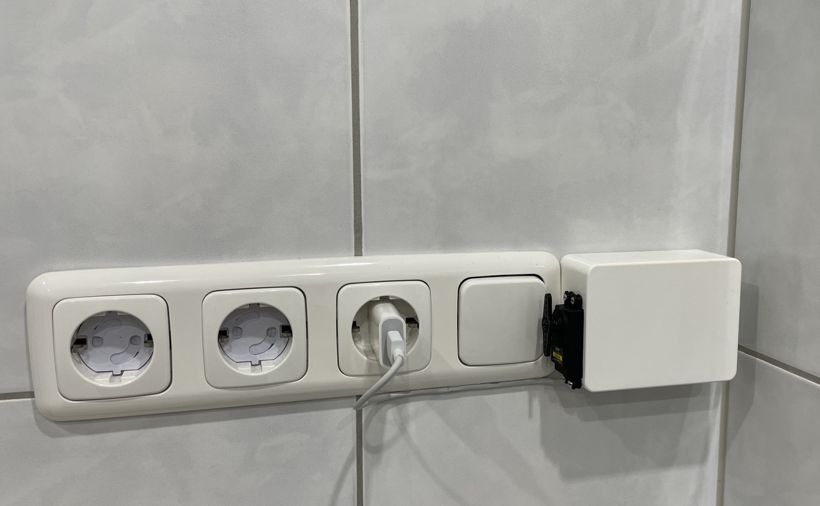

# Arduino Yún  MQTT switch

## Introduction

* Have an old Arduino Yún and a servo motor lying around?
* Need to automate a light switch etc. and don't want to deal with electrical
installation?

**We've got you covered!**

I used this setup to automate my old, not so smart bathroom fan without having
to fiddle around with the even older electric installation of my apartment.
All you need to do is to fit the Arduino and the servo motor into a nice looking
box and upload/fine-tune this code.

*Et voilà!* Enjoy turning your device on/off using MQTT commands and even
integrate it in systems like **Home Assistant** with a minimum effort.
:sparkles:

> :bulb: See the device [in action](./doc/action.mov)! More images are available
in the [doc](./doc) directory.



## Documentation

### MQTT messages

All topics are preceded by the base topic and the location tag, e.g.
`yun-switch/lightswitch-bedroom`.

By default, any message consists of a JSON formatted string and will be
retained.

> Note the internal payload buffer limitation of 100 characters.

| Direction | Topic       | Description                     | Options/example                                       |
|-----------|-------------|---------------------------------|-------------------------------------------------------|
| In        | `/command`  | Request to operate the switch.  | `{"switch":"top"}` or `{'pos':142}` for testing       |
| Out       | `/state`    | Current state of the switch.    | `{"actual":"neutral","latest":"top"}`                 |
| Out       | `/avail`    | Availability indication (LWT).  | `{"state":"online","version":"Oct 30 2023 10:54:00"}` |

### Home Assistant sample configuration

```yml
mqtt:
  - switch:
      name: Arduino Yun MQTT switch
      availability:
        payload_available: online
        payload_not_available: offline
        topic: yun-switch/{location}/avail
        value_template: "{{ value_json.state }}"
      state_topic: yun-switch/{location}/state
      state_on: top
      state_off: bottom
      value_template: "{{ value_json.latest }}"
      command_topic: yun-switch/{location}/command
      payload_on: '{"switch":"top"}'
      payload_off: '{"switch":"bottom"}'
      json_attributes_topic: yun-switch/{location}/state
      optimistic: false
```
